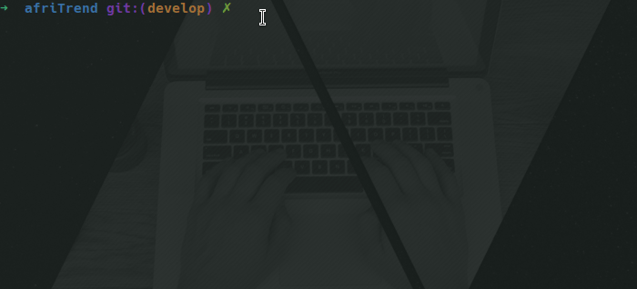

[![Contributors][contributors-shield]][https://github.com/Cyrus-Kiprop/afriTrend/graphs/contributors]
[![Forks][forks-shield]][https://github.com/Cyrus-Kiprop/afriTrend/network/members]
[![Stargazers][stars-shield]][https://github.com/Cyrus-Kiprop/afriTrend/stargazers]
[![Issues][issues-shield]][https://github.com/Cyrus-Kiprop/afriTrend/issues]
[![MIT License][license-shield]][https://github.com/Cyrus-Kiprop/afriTrend/blob/master/LICENSE]
[![LinkedIn][linkedin-shield]][https://www.linkedin.com/in/cyrus-kiprop-ba7320120/]

<!-- PROJECT LOGO -->
<br />
<p align="center">
  <a href="https://github.com/othneildrew/Best-README-Template">
    
  </a>

  <h3 align="center">AFRITREND LIFESTYLE WEB APP</h3>

  <p align="center">
    A web App created in the fulfillment of Microverse mandatory Ruby on Rails capstone project.
    <br />
    <a href="https://github.com/othneildrew/Best-README-Template"><strong>Explore the docs »</strong></a>
    <br />
    <br />
    <a href="https://afritrend.herokuapp.com/users/sign_in">View Demo</a>
    ·
    <a href="https://github.com/Cyrus-Kiprop/afriTrend/issues">Report Bug</a>
    ·
    <a href="https://github.com/Cyrus-Kiprop/afriTrend/issues">Request Feature</a>
  </p>
</p>

<!-- TABLE OF CONTENTS -->

## Table of Contents

- [About the Project](#about-the-project)
  - [Built With](#built-with)
- [Getting Started](#getting-started)
  - [Prerequisites](#prerequisites)
  - [Installation](#installation)
- [Usage](#usage)
- [Roadmap](#roadmap)
- [Contributing](#contributing)
- [License](#license)
- [Contact](#contact)
- [Acknowledgements](#acknowledgements)

<!-- ABOUT THE PROJECT -->

## About The Project

[![Product Name Screen Shot][product-screenshot]](https://example.com)

There are numerous lifestyle websites available on the internet today. This apps helps us plan our daily routine with ease and consume content at the comfort of our houses. I scoured the internet with aim to find lifestyle app that is well tailord based on a specific region, especially africa, however, I coul'nt find one that provided personal content based on regions. I have created and afriTrend inorder to address this shortcoming.

AfriTrend is aimed at providing the following content:

```sh
Nutrition
```

- Balanced nutrition content, which is based on africa native delicacies.
- ability to explore and compare different types of diets.
- Help in simplifying diets, by creating personalized diet based on native african recipes.

```sh
Fitness
```

- Articles related to fitness are added to the database. This provide a large pool of resources.
- One can acquire the composition of products throught the producrs.
- Articles constituting of multilevel training session for home based exercises.

```sh
Fashion
```

- Disover latest clothing trends from fashion's top designer in Africa

```sh

```

### Built With

The project was built using the following languages stacks:

```sh
Back-End(server)
```

- [Ruby -v 2.7.1](https://ruby-doc.org/)
- [Ruby on Rails -v 5.2+](https://rubyonrails.org/)

```sh
Front-End(client)
```

- [Bootstrap v 4](https://getbootstrap.com)
- [ERB](https://guides.rubyonrails.org/layouts_and_rendering.html)
- [Sass](https://sass-lang.com/)
- [Font Awesome Icons](https://fontawesome.com/icons?d=gallery)

```sh
Testing Frameworks
```

- [Capybara](https://github.com/teamcapybara/capybara)
- [RSpec](https://rspec.info/)

<!-- GETTING STARTED -->

## Getting Started

To get a local copy up and running follow these simple example steps.

### Prerequisites

- Ruby -v 2.7.1 -[click here](https://www.ruby-lang.org/en/)

- Rails -v 5.2.4

```sh
gem install rails -v 5.2.4
```

- Postgresql database [click here](https://www.digitalocean.com/community/tutorials/how-to-install-ruby-on-rails-with-rbenv-on-ubuntu-18-04)

### Installation

1. Clone the repo

```sh
git clone https://github.com/Cyrus-Kiprop/afriTrend.git
```

2. CD into the project roots directory

```sh
cd ./afriTrend
```

3. Install Dependencies and gems

```sh
bundle install
```

4. Set the databases

```sh
rails db:create
```

5. Create database schemas

```sh
rails db:migrate
```

<!-- USAGE EXAMPLES -->

## Usage

### Fire up the server:

```JS
rails s
```

### Navigate to your browser and open port 3000:

```JS
http//localhost:3000
```

### Create an Admin User



### Sign In

### Create Categories (Admin Only)

### Create a new article

### Upvote and Downvote

_For more examples, please refer to the [Documentation](https://example.com)_

<!-- ROADMAP -->

## Roadmap

See the [open issues](https://github.com/othneildrew/Best-README-Template/issues) for a list of proposed features (and known issues).

<!-- CONTRIBUTING -->

## Contributing

Contributions are what make the open source community such an amazing place to be learn, inspire, and create. Any contributions you make are **greatly appreciated**.

1. Fork the Project
2. Create your Feature Branch (`git checkout -b feature/NewAwesomeFeature`)
3. Commit your Changes (`git commit -m 'Add some NewAmazingFeature'`)
4. Push to the Branch (`git push origin feature/NewAmazingFeature`)
5. Open a Pull Request

<!-- CONTACT -->

## Contact

Cyrus Kiprop - cyruskiprop254@gmail.com

Project Link: [https://github.com/Cyrus-Kiprop/afriTrend](https://github.com/Cyrus-Kiprop/afriTrend)

## Authors

👤 **Cyrus Kiprop**

- Github: [Cyrus-Kiprop](https://github.com/Cyrus-Kiprop)
- Twitter: [@kipropJS](https://twitter.com/kipropJS)
- Linkedin: [Cyrus Kiprop](https://www.linkedin.com/in/cyrus-kiprop-ba7320120/)

## Acknowledgements

- [Heroku](https://afritrend.herokuapp.com)
- [Font Awesome](https://fontawesome.com)
- [Best-README-Template](https://github.com/othneildrew/Best-README-Template)
- [PNG-SVG converter](https://image.online-convert.com/convert-to-svg)

<!-- LICENSE -->

## License

Distributed under the MIT License. See [ LICENSE ](https://github.com/Cyrus-Kiprop/afriTrend/blob/master/LICENSE) for more information.
